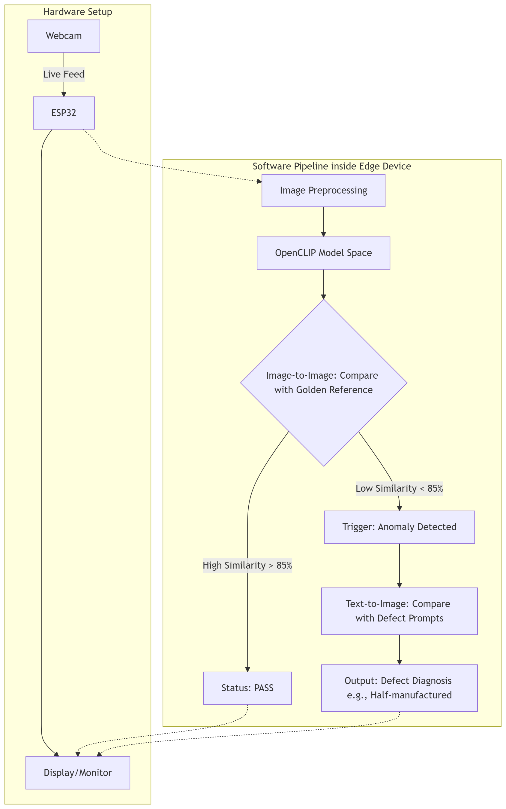

# Edge AI-Based PCB Verification System using OpenCLIP Model

An ultra-low-cost, distributed Edge AI inspection system that leverages the multimodal **OpenCLIP Vision Transformer** to perform zero-shot defect detection and natural language diagnosis on Printed Circuit Boards (PCBs).

---

## System Overview

Modern electronics manufacturing requires microscopic precision, traditionally relying on multi-million dollar AOI machines that utilize fragile, deterministic vision algorithms. This project democratizes quality control by combining highly accessible ESP32 microcontrollers with state-of-the-art foundational AI, bypassing the massive dataset training requirements of standard neural networks. 



### Distributed Edge Architecture
- **Sensory Node (ESP32 WROOM + OV7670):** The microcontroller acts purely as a high-speed data acquisition conduit. To prevent power brownouts and fatal memory crashes during electronic shutter actuation, the Wi-Fi and Bluetooth radios are permanently disabled via firmware (`WiFi.mode(WIFI_OFF)`). Raw, uncompressed YUV422 image bytes (QQVGA) are transmitted over a heavily synchronized 115200-baud USB tether to the processing node.
- **Edge Processing Node:** A localized Python pipeline reconstructs the 1D bytearray into a 3D image matrix, applies a 3x3 Median Blur to eradicate environmental Moiré distortion, and interfaces directly with the PyTorch OpenCLIP engine for analysis.


---

## AI Inference Pipeline

The system utilizes the `ViT-B-32` OpenCLIP architecture, pre-trained on the LAION-2B dataset. Because this model maps both visual geometry and natural language into the same mathematical latent space, it enables powerful "Zero-Shot" inspection.

### 1. Image-to-Image Validation (The Golden Reference)
The pipeline fundamentally relies on detecting deviations from perfection rather than attempting to classify infinite defect variations. 
1. At startup, a flawless "Golden Reference" PCB image is passed through the Vision Transformer to generate a dense, 512-dimensional mathematical feature vector. 
2. Live production boards are vectorized and evaluated against this cached baseline using a **Cosine Similarity** dot product. 
3. Based on empirical testing, the system enforces a strict **85% similarity threshold**. Scores $\ge$ 85% generate a `PASS` classification, while scores below this threshold instantly trigger the diagnostic modality.

### 2. Image-to-Text Semantic Diagnosis
If a structural anomaly (e.g., a missing surface-mount capacitor) causes the Cosine Similarity to drop below 85%, the pipeline cascades into an Image-to-Text evaluation. 
1. The live image vector is compared against an array of pre-tokenized natural language prompts (e.g., *"A defective printed circuit board with missing components or holes"*). 
2. A Softmax activation function converts the raw logits into a normalized probability distribution. 
3. The system autonomously outputs the highest-probability human-readable diagnosis to the operator, drastically reducing the Mean Time to Repair (MTTR).

---

## Hardware Configuration

The OV7670 CMOS camera communicates with the ESP32 via an I2C-compatible SCCB interface for configuration and an 8-bit parallel bus for image data transmission.

| OV7670 Pin | ESP32 GPIO | Function |
| :--- | :--- | :--- |
| **3.3V / GND** | 3V3 / GND | Clean logic power |
| **SIOC / SIOD** | GPIO 27 / 26 | SCCB Configuration Interface |
| **VSYNC / HREF** | GPIO 25 / 23 | Frame and Row Synchronization |
| **PCLK / XCLK** | GPIO 22 / 21 | Pixel Clock / 20MHz System Clock |
| **D7 - D0** | 35, 34, 32, 33, 19, 18, 5, 4 | 8-Bit Parallel Image Data Bus |
| **Buzzer** | GPIO 14 | Auditory Diagnostic Feedback |

---

## Installation & Execution

### 1. Microcontroller Setup
1. Open `ESP32_Camera_Capture.ino` in the Arduino IDE.
2. Select the **ESP32 Dev Module** board and flash the firmware.
3. Ensure the ESP32 remains connected via a high-quality data USB cable to maintain the 115200-baud serial tether.

### 2. Python Environment
1. Ensure Python 3.9+ is installed.
2. Install the required deep learning and computer vision dependencies:
   ```bash
   pip install torch torchvision torchaudio opencv-python numpy open_clip_torch pyserial Pillow
   ```
3. Update `ESP32_PORT` in the Python script to match your specific COM port (e.g., COM7)

### 3. Running the Inspection
1. Capture or provide a perfect top-down image of your target PCB.
2. Rename this image to Golden_Reference.png and place it in the working directory.
3. Execute the pipeline:
   ```bash
   python OpenCLIP_Inference_Pipeline.py
   ```
4. Press `[ENTER]` in the terminal to trigger an inspection cycle. Listen for the dual-beep auditory confirmation from the ESP32 buzzer.
